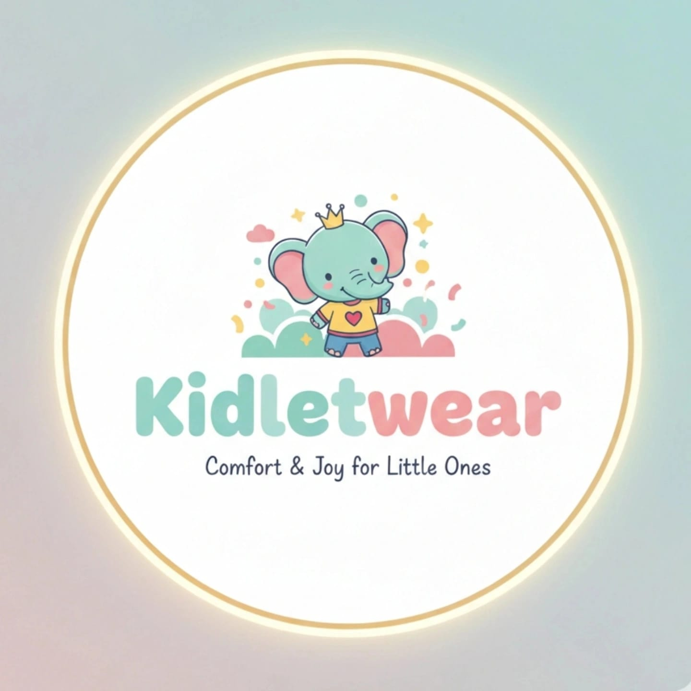

# KidLet Wear - Premium E-Commerce Website



## 🎉 Welcome to KidLet Wear!

A fully functional, premium e-commerce website for kids & teen clothing, built with **pure HTML, CSS, and JavaScript** (no frameworks!). Designed to convert your offline success in Delhi into a stunning online presence.

---

## ✨ Features

### 🎨 **Premium Design**
- **Vibrant, teen-friendly color palette** with gradients and glassmorphism
- **Dark/Light mode** toggle for user preference
- **Smooth animations** and parallax effects
- **Mobile-first responsive** design
- **Floating cards** with shimmer effects
- **Gradient orbs** background animation

### 🛍️ **E-Commerce Functionality**
- **Product catalog** with 12+ sample products
- **Category filtering** (Casual, Trendy, Ethnic, Party)
- **Shopping cart** with add/remove/quantity controls
- **Wishlist** feature with localStorage persistence
- **Product cards** with hover effects, color swatches, ratings
- **Load more** pagination
- **Search** functionality

### 🤖 **AI Chatbot**
- Intelligent responses for:
  - Product recommendations
  - Size guide assistance
  - Delivery information
  - Payment options
  - Order tracking
  - Returns & refunds
- **Quick action buttons** for common queries
- **Conversation history** tracking

### 🎯 **User Experience**
- **Gamification**: Welcome badge, first purchase incentive
- **Smooth scrolling** navigation
- **Intersection Observer** animations
- **Lazy loading** images for performance
- **PWA-ready** (install prompt)
- **Newsletter** signup
- **Social proof** with customer testimonials

### 💳 **Checkout Flow**
- Multiple payment options (UPI, Cards, COD)
- Order summary with delivery estimate
- 200km delivery radius validation
- Demo checkout process

### 📱 **Mobile Optimized**
- Hamburger menu for mobile
- Touch-friendly buttons
- Responsive grid layouts
- Mobile cart sidebar (full width)

---

## 🚀 How to Use

### **Option 1: Direct Open (Recommended)**
1. Navigate to: `d:\Extra\Programming\WebDevs\Portfolio\Aditya\`
2. **Double-click `index.html`** to open in your default browser
3. That's it! The website is fully functional.

### **Option 2: Live Server (Better for Development)**
1. Install [Live Server](https://marketplace.visualstudio.com/items?itemName=ritwickdey.LiveServer) in VS Code
2. Right-click `index.html` → **"Open with Live Server"**
3. Enjoy hot-reload during development

### **Option 3: Python Server**
```bash
cd "d:\Extra\Programming\WebDevs\Portfolio\Aditya"
python -m http.server 8000
```
Then open: `http://localhost:8000`

---

## 📂 Project Structure

```
Aditya/
├── index.html              # Main HTML file
├── Logo.jpeg               # Your KidLet Wear logo
├── css/
│   └── styles.css          # All styles (8000+ lines of premium CSS)
└── js/
    ├── products.js         # Product data & filtering
    ├── cart.js             # Shopping cart functionality
    ├── chatbot.js          # AI chatbot logic
    └── main.js             # Theme, navbar, animations, PWA
```

---

## 🎨 Design Highlights

### **Color Palette**
- **Primary**: Purple gradient (#8B5CF6 → #EC4899)
- **Secondary**: Green-Blue gradient (#10B981 → #3B82F6)
- **Accent**: Orange-Red gradient (#F59E0B → #EF4444)
- **Dark Mode**: Smooth transitions with preserved gradients

### **Typography**
- **Headings**: Outfit (Google Fonts) - Bold, modern
- **Body**: Inter (Google Fonts) - Clean, readable

### **Animations**
- Floating cards with shimmer effect
- Gradient orbs with 20s float animation
- Smooth hover effects on all interactive elements
- Parallax scrolling on hero section
- Intersection Observer for scroll-triggered animations

---

## 🛠️ Key Functionalities

### **1. Product Catalog**
- 12 sample products across 4 categories
- Dynamic rendering from JavaScript array
- Filter by category (all/casual/trendy/ethnic/party)
- Load more pagination (8 initial, +4 per click)
- Color swatches, size options, ratings

### **2. Shopping Cart**
- Add/remove products
- Quantity controls (+/-)
- Persistent storage (localStorage)
- Real-time total calculation
- Slide-out sidebar with smooth animations
- Empty state with icon

### **3. AI Chatbot**
- Pattern matching for intelligent responses
- Context-aware suggestions
- Quick action buttons
- Conversation history
- Floating widget (bottom-right)
- Smooth open/close animations

### **4. Theme System**
- Light/Dark mode toggle
- Persistent preference (localStorage)
- Smooth transitions on all elements
- Icon swap (sun/moon)
- CSS custom properties for easy theming

### **5. Navigation**
- Sticky navbar with blur backdrop
- Active link highlighting on scroll
- Mobile hamburger menu
- Smooth scroll to sections
- Search functionality

---

## 🎯 Target Audience

- **Age**: Under 18 (teens and young shoppers)
- **Location**: Delhi + 200km radius
- **Style**: Trendy, vibrant, social media-savvy

---

## 📊 Performance Features

- **Lazy loading** images (native + fallback)
- **Intersection Observer** for efficient animations
- **LocalStorage** for cart/wishlist/theme persistence
- **Debounced** scroll events
- **Optimized** CSS with custom properties
- **PWA-ready** (manifest + service worker hooks)

---

## 🔥 Unique Selling Points

1. **Psychology-Optimized Design**
   - Vibrant colors trigger excitement
   - Gamification increases engagement
   - Social proof builds trust
   - Smooth animations feel premium

2. **Local Focus**
   - 200km delivery radius
   - Delhi-centric SEO
   - COD/UPI for Indian market
   - Local customer testimonials

3. **Teen-Friendly**
   - "Shop by Mood" instead of boring categories
   - Emoji-rich chatbot
   - Trendy language and visuals
   - Instagram-worthy design

---

## 🚀 Next Steps (Production)

### **Backend Integration**
- Connect to real database (MongoDB/PostgreSQL)
- Implement user authentication (JWT/OAuth)
- Payment gateway integration (Razorpay/Stripe)
- Order management system
- Admin panel for product/order management

### **Advanced Features**
- Real AI recommendations (ML model)
- AR try-on (third-party service)
- Email notifications (SendGrid/Mailgun)
- SMS alerts for orders
- Analytics dashboard

### **Deployment**
- Host on **Vercel/Netlify** (frontend)
- Backend on **Railway/Render**
- CDN for images (Cloudinary)
- Domain setup (kidletwear.com)

---

## 📱 Mobile Testing

The website is fully responsive! Test on:
- **Desktop**: 1920x1080, 1440x900
- **Tablet**: 768x1024 (iPad)
- **Mobile**: 375x667 (iPhone), 360x640 (Android)

Use Chrome DevTools (F12) → Toggle device toolbar (Ctrl+Shift+M)

---

## 🎨 Customization Guide

### **Change Brand Colors**
Edit `css/styles.css` → `:root` section:
```css
--primary: #8B5CF6;  /* Your brand color */
--secondary: #EC4899; /* Accent color */
```

### **Add Products**
Edit `js/products.js` → `products` array:
```javascript
{
    id: 13,
    name: "Your Product",
    category: "casual",
    price: 999,
    // ... more fields
}
```

### **Customize Chatbot**
Edit `js/chatbot.js` → `responses` object

---

## 🐛 Troubleshooting

### **Images not loading?**
- Products use Unsplash placeholder images (requires internet)
- Replace with your own product images in `assets/` folder

### **Cart not persisting?**
- Check browser localStorage is enabled
- Clear cache and reload

### **Animations not smooth?**
- Disable browser hardware acceleration
- Check for browser extensions blocking animations

---

## 📞 Support

Built with ❤️ for **KidLet Wear**

For questions or customization requests, reach out to your development team!

---

## 🎉 Enjoy Your New E-Commerce Website!

**Open `index.html` now and experience the magic!** ✨

---

## 📝 Technical Notes

- **No dependencies**: Pure HTML/CSS/JS (works offline!)
- **No build process**: Just open and run
- **Cross-browser**: Chrome, Firefox, Safari, Edge
- **SEO-ready**: Semantic HTML, meta tags, structured data
- **Accessible**: ARIA labels, keyboard navigation
- **Secure**: No external scripts (except Google Fonts)

---

**Version**: 1.0.0  
**Last Updated**: February 2026  
**License**: Proprietary (KidLet Wear)
